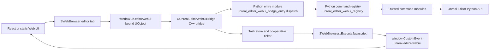

# Architecture

`unreal-editor-webui` is an editor-only bridge from a trusted browser surface to a curated Python command registry. The bridge is designed for internal tools that need Web UI ergonomics while still respecting Unreal Editor threading, permissions, and project safety.

## Runtime Path



## Main Pieces

- `Source/UnrealEditorWebUI/Private/UnrealEditorWebUIModule.cpp` creates the dock tab, owns `SWebBrowser`, binds the bridge object as `window.ue.editorwebui`, dispatches task events back into the page, and blocks unsafe navigations.
- `Source/UnrealEditorWebUI/Private/UnrealEditorWebUIBridge.cpp` implements bridge methods, request preflight, native confirmation for privileged commands, task lifecycle storage, cancellation, timeout handling, and settings reads/writes.
- `Python/unreal_editor_webui_bridge_entry.py` is the C++ to Python entry point. C++ evaluates a short import/dispatch expression with base64 arguments and receives JSON in memory through `ExecPythonCommandEx`.
- `Python/unreal_editor_webui_registry.py` registers trusted commands, exposes `system.commands`, applies schema defaults, validates payloads, checks permission policy, and dispatches handlers.
- `frontend/src/` is the React tool rack. It discovers commands from `system.commands`, renders schema-driven forms, persists tool preferences, shows task state, and renders structured results.

## Request Flow

1. A page calls `window.ue.editorwebui.executecommand(requestJson)` or `startcommand(requestJson)`.
2. The C++ bridge calls Python `inspect_command` first. This validates the request shape, command existence, payload schema, default values, permission, and execution metadata before a handler can run.
3. For `write` and `destructive` commands, the C++ bridge asks for native editor confirmation. `write` approvals are scoped to the current WebUI tab session and command; `destructive` commands require confirmation every time.
4. C++ calls Python `execute_command` through `unreal_editor_webui_bridge_entry.dispatch`.
5. Python returns a JSON envelope with `{ id, ok, result }` or `{ id, ok: false, error }`.

## Task Flow

`startcommand` returns a task record immediately. The current Python registry commands still run on the editor game thread unless metadata marks them as cooperative `editor_tick` work. The bridge stores each task with:

- `status`: `queued`, `running`, `completed`, `failed`, `cancelled`, or `timed_out`.
- `progress`: `0` to `100`.
- `logs`: bounded task log lines.
- `executionThread`, `cancellationMode`, `timeoutPolicy`, and `message`.
- `responseJson`: final command response when available.

The bridge pushes task status events into the browser with `SWebBrowser::ExecuteJavascript`. The page receives them as:

```js
window.addEventListener("unreal-editor-webui", (event) => {
  console.log(event.detail.type, event.detail.taskId, event.detail.status);
});
```

The React app also polls `gettask(taskId)` as a recovery path, so task state survives page reloads and dropped events.

## Trust Boundary

The bridge is intentionally available only to allowed URLs:

- Packaged files under the plugin `Web/` directory.
- `about:blank`.
- Loopback `http(s)` URLs such as `http://localhost:5173`, `http://127.0.0.1:5173`, and `http://[::1]:5173`.

Remote origins are rejected by settings validation and blocked during browser navigation. Privileged approvals are cleared when the WebUI navigates to a different allowed URL.

## Validation

Local and CI validation entry points:

- `python -m unittest tests.test_registry` covers the registry and Python entry dispatch.
- `npm run lint`, `npm test`, and `npm run build` cover the React frontend.
- `scripts/package-plugin.ps1` and `scripts/package-plugin.sh` build the frontend and run UE `BuildPlugin`.
- `.github/workflows/ci.yml` runs hosted frontend/Python validation.
- `.github/workflows/ue-ci.yml` runs UE BuildPlugin and automation on a licensed Windows self-hosted runner.

