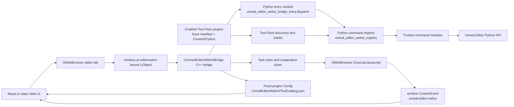

# Architecture

`unreal-editor-webui` is an editor-only bridge from a trusted browser surface to a curated Python command registry. The bridge is designed for internal tools that need Web UI ergonomics while still respecting Unreal Editor threading, permissions, and project safety.

## Runtime Path


```mermaid
flowchart LR
    A["React or static Web UI"] --> B["SWebBrowser editor tab"]
    B --> C["window.ue.editorwebui bound UObject"]
    C --> D["UUnrealEditorWebUIBridge C++ bridge"]
    D --> E["Python entry module<br/>unreal_editor_webui_bridge_entry.dispatch"]
    E --> F["Python command registry<br/>unreal_editor_webui_registry"]
    F --> G["Trusted command modules"]
    G --> H["Unreal Editor Python API"]
    M["Enabled Tool Pack plugins<br/>fixed manifest + Content/Python"] --> N["Tool Pack discovery and loader"]
    N --> F
    D --> I["Task store and cooperative ticker"]
    I --> J["SWebBrowser::ExecuteJavascript"]
    J --> K["window CustomEvent<br/>unreal-editor-webui"]
    K --> A
    D --> L["Fixed project Config<br/>UnrealEditorWebUI/ToolCatalog.json"]
    L --> A
```

## Main Pieces

- `Source/UnrealEditorWebUI/Private/UnrealEditorWebUIModule.cpp` creates the dock tab, owns `SWebBrowser`, binds the bridge object as `window.ue.editorwebui`, dispatches task events back into the page, and blocks unsafe navigations.
- `Source/UnrealEditorWebUI/Private/UnrealEditorWebUIBridge.cpp` implements bridge methods, request preflight, native confirmation for privileged commands, task lifecycle storage, cancellation, timeout handling, settings reads/writes, and the bounded read-only project catalog transport.
- `Python/unreal_editor_webui_bridge_entry.py` is the C++ to Python entry point. C++ evaluates a short import/dispatch expression with base64 arguments and receives JSON in memory through `ExecPythonCommandEx`.
- `Python/unreal_editor_webui_sdk` is the stable decorator and structured-error API imported by built-in and third-party commands.
- `Python/unreal_editor_webui_toolpacks.py` discovers enabled and mounted Unreal plugins with a fixed schema-v1 manifest under `Content/UnrealEditorWebUI/ToolPack.json`.
- `Python/unreal_editor_webui_registry.py` registers trusted commands, atomically loads each Tool Pack, exposes `system.commands` plus the bounded `system.toolPacks` provider-status view, applies schema defaults, validates payloads, checks permission policy, and dispatches handlers.
- `frontend/src/` is the React tool rack. It discovers commands from `system.commands`, strictly decodes either the fixed project catalog or the bundled starter, renders schema-driven forms, persists reconciled project-scoped preferences only after both native contexts resolve, shows task state, and renders structured results.

## Request Flow

1. A page calls `window.ue.editorwebui.executecommand(requestJson)` or `startcommand(requestJson)`.
2. The C++ bridge calls Python `inspect_command` first. This validates the request shape, command existence, payload schema, default values, permission, and execution metadata before a handler can run.
3. For every real `write` and `destructive` invocation, the C++ bridge asks for native editor confirmation with the command and a bounded normalized-payload summary. The resulting exact-command capability is single-use and is not cached.
4. C++ calls Python `execute_command` through `unreal_editor_webui_bridge_entry.dispatch`.
5. Python returns a JSON envelope with `{ id, ok, result }` or `{ id, ok: false, error }`.

## Task Flow

`startcommand` returns a task record immediately. The current Python registry commands still run on the editor game thread unless metadata marks them as cooperative `editor_tick` work. The bridge stores each task with:

- `status`: `queued`, `running`, `completed`, `failed`, `cancelled`, or `timed_out`.
- `progress`: `0` to `100`.
- `logs`: bounded task log lines.
- `executionThread`, `cancellationMode`, `timeoutPolicy`, and `message`.
- `responseJson`: final command response when available.

The bridge owns at most 64 retained tasks and stores bounded logs and responses. `listtasks()` serializes lifecycle summaries only; `gettask(taskId)` is the explicit detail path for payloads, logs, and final responses. The bridge pushes bounded task status events into the browser with `SWebBrowser::ExecuteJavascript`. The page receives them as:

```js
window.addEventListener("unreal-editor-webui", (event) => {
  console.log(event.detail.type, event.detail.taskId, event.detail.status);
});
```

The React app treats these events as the real-time update path. It uses one low-frequency `listtasks()` reconciliation request—paused while the page is hidden—to recover from dropped events without issuing one poll per active task, and loads full details only when requested. Each top-level document load rotates an opaque task session, so a reloaded or replaced page cannot enumerate or mutate tasks created by the prior document.

## Trust Boundary

The bridge is intentionally available only to allowed URLs:

- Packaged files under the plugin `Web/` directory.
- `about:blank`.
- The exact configured loopback `http(s)` origin, including scheme, hostname, and normalized port.

Remote origins and different loopback origins are rejected by settings validation or blocked during browser navigation. The UObject uses a non-permanent `SWebBrowser` binding registered in `OnLoadStarted`, so CEF removes the old proxy when navigating away. Privileged approvals are single-use, and task access is scoped to the current top-level document.

Browser persistence is fail-closed. The frontend enables it only after `getprojectcontext()` returns protocol version `1` and a valid project namespace. Legacy global keys are quarantined rather than automatically assigned to a project whose ownership cannot be proven.

The optional runtime catalog is also fail-closed. `gettoolcatalog()` has no path argument and reads
only `<Project>/Config/UnrealEditorWebUI/ToolCatalog.json`. Native code limits and parses the file;
the frontend is the semantic schema-v1 authority. A missing file selects the bundled starter. A
rejected file also falls back but disables automatic preference rewrites until a valid catalog is
loaded, preventing a transient configuration error from destroying project-specific selections.
Catalog contents organize already trusted registry metadata and never grant command permissions.

Third-party Tool Packs are also trusted code, not a Python sandbox. Discovery accepts no arbitrary
path from a manifest and verifies the package under the enabled plugin's canonical
`Content/Python` root. Registration state and newly imported modules are rolled back when a pack
fails, but Unreal, filesystem, thread, network, or process side effects performed during import
cannot be undone. Enabling a Tool Pack is therefore a code-trust decision. See
[Third-Party Tool Packs](tool-packs.md) for the extension contract and conflict rules.

Runtime health uses a separate no-argument `getwebuihealth()` method. Native code classifies the
validated document session into `packaged`, `loopback_http`, `loopback_https`, or `inactive` and
stores only that category, never the URL or authority. Its closed response contains only public,
bounded version strings and fixed capability enums. The React support-report builder then selects
those decoded fields plus persistence/catalog/registry states and aggregate task counts into a new
closed object. It never receives a settings object, project identity, catalog/command entry, task
record, log, or raw error to redact after the fact. One shared pure function derives the panel and
report `overallStatus` plus ordered fixed `reasonCodes`, so rendered and copied diagnoses cannot
drift.

## Resource Bounds

The native bridge rejects command requests above 256 Ki characters, settings above 64 Ki characters, permission policies above 16 Ki characters, registry responses above 4 MiB UTF-8, task responses above 1.5 MiB UTF-8, serialized task details above 4 MiB UTF-8, task identifiers above 128 characters, browser log messages above 16 Ki characters, and task events above 64 KiB UTF-8. The project catalog is read as a single strict UTF-8 byte snapshot capped at 128 KiB and rejected above 16 JSON levels or 10,000 structural nodes before DOM parsing. The frontend support report is capped at 4 KiB UTF-8. Terminal responses are fetched through `gettask()` and are never copied into DOM events. Python independently enforces 256 KiB UTF-8 requests, 4 MiB UTF-8 responses, JSON depth 32, 10,000 JSON nodes, and at most 64 active cooperative jobs. Task logs retain at most 80 lines of 2,048 characters, and full retained task responses share a 16 Mi-character budget.

## Validation

Local and CI validation entry points:

- `python -m unittest discover -s tests -v` covers the registry, Tool Pack discovery/isolation, and Python entry dispatch. The Node test suite covers host-project and Tool Pack scaffolding contracts.
- `npm run lint`, `npm test`, and `npm run build` cover the React frontend.
- Root `npm ci`, `node --test tests/validate-github-action-references.test.mjs`, and `node scripts/validate-github-action-references.mjs` validate every executable workflow action reference through a YAML 1.2 AST and require immutable external commit SHAs.
- `scripts/package-plugin.ps1` and `scripts/package-plugin.sh` use the shared exact-commit staging helper to rebuild the frontend, emit a pre-UBT source manifest, and run UE `BuildPlugin` without consuming dirty or untracked working-tree files.
- `.github/workflows/ci.yml` runs hosted frontend/Python validation.
- `.github/workflows/ue-ci.yml` runs UE BuildPlugin and automation on a licensed Windows self-hosted runner.
- `.github/workflows/release-candidate.yml` consumes only an exact-commit successful UE artifact and emits a short-lived candidate archive, SHA-256, SBOM, dependency inventory, and provenance.

