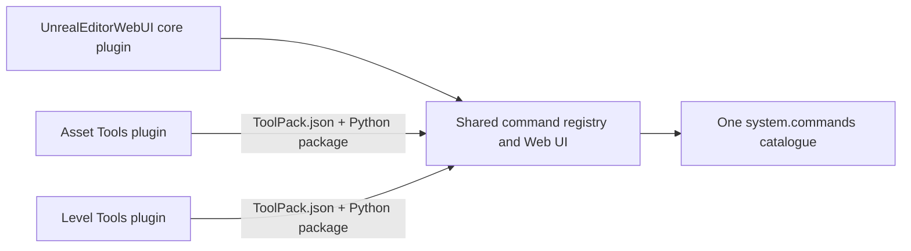

# Third-Party Tool Packs

One installed `UnrealEditorWebUI` core plugin can host commands from many independent Unreal
plugins. A **Tool Pack payload** may live in a dedicated content-only plugin or an existing
business plugin with C++ modules. In both cases the host plugin declares a dependency on the
core, ships a fixed manifest and a Python package, and imports only the stable
`unreal_editor_webui_sdk` API. Tool Pack authors do not edit or copy the core registry, bridge, or
React application.



Tool Packs are the command-extension boundary. Command metadata automatically produces the
standard forms and JSON result view. A bespoke React result renderer is still a core-frontend
change.

## Create A Pack

On Windows, scaffold a content-only plugin from the repository root:

```powershell
New-Item -ItemType Directory -Force -Path "$PWD\generated-tool-packs" | Out-Null
powershell -ExecutionPolicy Bypass -File scripts/create-tool-pack.ps1 `
  -Name StudioAssetTools `
  -Id com.studio.asset-tools `
  -CommandNamespace studio.assets `
  -OutputDirectory "$PWD\generated-tool-packs"
```

The output is a complete Unreal plugin directory. The script refuses unsafe identifiers,
path traversal, reparse-point output roots, and overwrites, then runs the same Python validator
used by runtime discovery before publishing the directory. A working reference is available at
[`examples/tool-packs/ExampleAssetTools`](../examples/tool-packs/ExampleAssetTools).

The required layout is:

```text
StudioAssetTools/
|-- StudioAssetTools.uplugin
`-- Content/
    |-- UnrealEditorWebUI/
    |   `-- ToolPack.json
    `-- Python/
        `-- ue_webui_toolpack_studio_asset_tools/
            |-- __init__.py
            `-- commands.py
```

`StudioAssetTools.uplugin` must be enabled, mounted, content-capable, and declare the core
dependency:

```json
{
  "FileVersion": 3,
  "Version": 1,
  "VersionName": "1.0.0",
  "CanContainContent": true,
  "NoCode": true,
  "Plugins": [
    { "Name": "UnrealEditorWebUI", "Enabled": true }
  ]
}
```

`NoCode: true` describes this standalone scaffolder output; it is not part of the runtime Tool
Pack contract.

## Add A Pack To An Existing Business Plugin

Project teams can keep their existing plugin repository and add only the Tool Pack payload. The
plugin may already contain `Modules`, content, settings, and unrelated plugin dependencies.
Run the script from this repository with its supported Node.js version available on `PATH`:

```powershell
powershell -ExecutionPolicy Bypass -File scripts/add-tool-pack.ps1 -PluginDirectory "D:\StudioPlugins\Plugins\StudioAssetTools" -Id com.studio.asset-tools -CommandNamespace studio.assets -WhatIf

powershell -ExecutionPolicy Bypass -File scripts/add-tool-pack.ps1 -PluginDirectory "D:\StudioPlugins\Plugins\StudioAssetTools" -Id com.studio.asset-tools -CommandNamespace studio.assets
```

The first command validates and previews the operation without writing. The second command:

- preserves every unrelated `.uplugin` field, existing `Modules`, and existing dependencies;
- sets `CanContainContent` to `true`;
- adds or normalizes one enabled `UnrealEditorWebUI` dependency;
- creates the fixed manifest plus a unique
  `ue_webui_toolpack_<plugin_name>` Python package and a smoke command.

The script requires exactly one regular root `.uplugin`, parses it as strict UTF-8 JSON, rejects
duplicate decoded JSON keys and ambiguous field casing, and refuses plugin directories or output
paths that are reparse points. It never overwrites an existing `ToolPack.json` or generated Python
package. Running it again reports a conflict and leaves the plugin unchanged.

An existing code-plugin descriptor remains a code plugin:

```json
{
  "FileVersion": 3,
  "Version": 17,
  "VersionName": "2.4.1",
  "CanContainContent": true,
  "Modules": [
    {
      "Name": "StudioAssetTools",
      "Type": "Editor",
      "LoadingPhase": "Default"
    }
  ],
  "Plugins": [
    { "Name": "UnrealEditorWebUI", "Enabled": true }
  ]
}
```

The runtime boundary is the manifest and Python package inside an enabled, mounted,
content-capable plugin. It does not require `NoCode`, remove C++ modules, or copy the shared core
into the business plugin.

## Validate Packs Offline

Run the authoritative validator before copying, packaging, or enabling a Tool Pack. Repeat
`--plugin-dir` to check cross-pack identity, top-level Python-package, and namespace conflicts in
one deterministic pass:

```powershell
python scripts/validate-tool-pack.py --plugin-dir "D:\StudioPlugins\Plugins\StudioAssetTools" --plugin-dir "D:\StudioPlugins\Plugins\StudioLevelTools" --format human

python scripts/validate-tool-pack.py --plugin-dir "D:\StudioPlugins\Plugins\StudioAssetTools" --plugin-dir "D:\StudioPlugins\Plugins\StudioLevelTools" --format json
```

Exit code `0` means every input is valid and mutually compatible; exit code `1` means at least one
pack failed. JSON output uses schema version 1, stable lowercase `reasonCode` values, deterministic
ordering, and plugin identities only—never absolute input paths. Valid pack records include the
strict `.uplugin` `VersionName` as `pluginVersion` for downstream artifact naming.

The validator checks exactly one strict root `.uplugin`, a safe `VersionName`,
`CanContainContent`, one exact enabled core dependency, the closed schema-v1 or schema-v2 manifest, core API 1,
package and `__init__.py` files, path containment, and reparse points. It also reserves current core
command namespaces (`asset`, `demo`, `editor`, and `system`) and rejects every side of pack ID,
top-level Python package, plugin-name, or dot-boundary namespace conflicts. Directory scans are
bounded to 10,000 entries and 64 levels; exceeding either returns `scan_limit_exceeded`.

Dependency diagnostics distinguish `core_dependency_missing`, `core_dependency_duplicate`, and
`core_dependency_disabled`. Other stable examples include `manifest_json_duplicate`,
`core_api_incompatible`, `python_package_conflict`, and `command_namespace_conflict`. Human text
may become clearer over time; automation should branch on `reasonCode`. Runtime discovery also
uses `plugin_version_mismatch` if Unreal's mounted-plugin API disagrees with the already validated
descriptor instead of masking either value.

## Manifest Contract

The manifest location is fixed:

```text
<ToolPack>/Content/UnrealEditorWebUI/ToolPack.json
```

New scaffolds use schema v2. It is a closed object with exactly these fields:

```json
{
  "schemaVersion": 2,
  "id": "com.studio.asset-tools",
  "requiredCoreApi": 1,
  "pythonPackage": "ue_webui_toolpack_studio_asset_tools",
  "commandNamespace": "studio.assets",
  "entryModules": ["commands"],
  "dependencyPolicy": {
    "purePython": { "mode": "none", "treeSha256": null },
    "native": { "mode": "none" }
  }
}
```

`entryModules` contains 1–32 relative dotted module names below `pythonPackage`. Names are
bounded, portable, unique, cannot name `__init__`, and must resolve to exactly one `.py` module or
package. The core actively imports only these entries. An entry may explicitly import ordinary
helpers or vendored modules, but an undeclared helper or parent package `__init__.py` cannot
register commands; doing so rejects and rolls back the complete pack. A package explicitly named
as an entry registers from its own `__init__.py`. Python necessarily executes parent package
initializers while importing an entry, so keep undeclared initializers side-effect free.

`dependencyPolicy` is also closed. `purePython.mode: "none"` requires no `_vendor` package.
`purePython.mode: "vendored"` requires `<pythonPackage>/_vendor/__init__.py` and a
`treeSha256` computed by the same bounded canonical scanner used by the packager, doctor, and
runtime. A missing or changed file rejects the pack. In-process `.pyd`, `.so`, and `.dylib`
dependencies are unsupported. Native tools must use `native.mode: "outOfProcess"` and perform
their own UE/Python/platform compatibility checks across the process boundary. Runtime `pip`
installation is unsupported.

Schema v1 remains accepted byte-for-byte with exactly these fields:

```json
{
  "schemaVersion": 1,
  "id": "com.studio.asset-tools",
  "requiredCoreApi": 1,
  "pythonPackage": "ue_webui_toolpack_studio_asset_tools",
  "commandNamespace": "studio.assets"
}
```

- `id` is the stable lowercase pack identity. Use a reverse-DNS value.
- `requiredCoreApi` must equal `unreal_editor_webui_sdk.SDK_API_VERSION`. Version 1 intentionally
  uses exact integer matching.
- `pythonPackage` is a dotted import name rooted under the same plugin's `Content/Python`. It must
  resolve to a real package, with every dotted package segment containing `__init__.py`; it is not
  a file path or namespace package. Its top-level segment must be globally unique across all Tool
  Packs and must not collide with an already importable or Python standard-library package. The
  scaffolder adds a `ue_webui_toolpack_` prefix for this reason.
- `commandNamespace` owns that dotted command prefix. Every command registered by the pack must
  start with `<commandNamespace>.`. It must not equal, contain, or be contained by another Tool
  Pack namespace on a dot boundary. For example, `studio.assets` conflicts with
  `studio.assets.validate`, while `studio.assets2` is independent.

Unknown keys, duplicate JSON keys, unsupported versions, malformed identifiers, oversized or
deep manifests, escaped paths, and missing packages reject that pack. The manifest cannot add a
Python search path or name an arbitrary file.

Schema v1 keeps its historical recursive package import behavior. Migrate by moving command
registration into explicit modules, setting `entryModules`, declaring the dependency policy, and
changing only `schemaVersion` plus the two v2 fields. As a deliberate security exception for both
versions, `Content/Python/init_unreal.py` is rejected; existing v1 manifest bytes and fields remain
unchanged.

## Register Commands Through The SDK

Third-party code imports the public SDK, never `unreal_editor_webui_registry`:

```python
from typing import Any

from unreal_editor_webui_sdk import CommandExecutionError, command


@command(
    "studio.assets.validate",
    description="Validate selected assets.",
    permission="read",
    schema={
        "type": "object",
        "properties": {
            "strict": {"type": "boolean", "default": False},
        },
        "additionalProperties": False,
    },
    category="Studio Asset Tools",
    tags=["assets", "validation"],
)
def validate(payload: dict[str, Any]) -> dict[str, Any]:
    if payload["strict"] and not can_run_strict_validation():
        raise CommandExecutionError(
            "strict_validation_unavailable",
            "Strict validation is unavailable in this project.",
        )
    return {"valid": True}
```

Place `.py` modules or packages containing `__init__.py` below the declared package. For v2 the
core builds an exact canonical-file allowlist and actively imports only sorted declared entries;
explicit imports from an entry remain inside that allowlist. V1 continues to import the package
and walk all submodules in deterministic order. Keep module top levels limited to imports and
command registration; perform editor or filesystem work inside handlers.

Do not import the package from `init_unreal.py` or another startup hook. SDK registration is open
only while the core is explicitly loading built-ins or that Tool Pack; registration outside that
context is rejected so namespace ownership and whole-pack rollback cannot be bypassed.

Every command name must be a dotted ASCII identifier with at least two segments and at most 256
characters. Each segment starts with a lowercase letter; remaining characters may be ASCII
letters, digits, or underscores, so lower-camel names such as `studio.assets.validateNaming` are
valid. Whitespace, hyphens, empty segments, uppercase segment starts, and oversized names reject
the complete pack atomically.

The command schema, permissions, task execution metadata, and response envelopes are the same as
built-in commands. See [the integration guide](integration-guide.md#discover-commands)
for the schema-v1 contract.

## Opt In To A Project Trust Policy

Policy enforcement is disabled when this fixed file is absent:

```text
<Project>/Config/UnrealEditorWebUI/ToolPackPolicy.json
```

To enable it, commit a closed policy object to the project:

```json
{
  "format": "unreal-editor-webui-tool-pack-policy",
  "schemaVersion": 1,
  "packs": [
    {
      "packId": "com.studio.asset-tools",
      "pluginVersion": "1.2.0",
      "requiredCoreApi": 1,
      "payloadSha256": "sha256:0123456789abcdef0123456789abcdef0123456789abcdef0123456789abcdef"
    }
  ]
}
```

Use the canonical distribution manifest `payload.treeSha256` emitted by
`scripts/package-tool-pack.py`; do not invent or hash a ZIP manually. Once the file exists, an
invalid/duplicate/oversized/unknown policy field, an unlisted installed pack, version/API drift,
or payload-tree drift rejects the affected import before Tool Pack Python runs. A policy entry for
a pack that is not installed rejects the aggregate policy state. Policy reason codes are fixed,
bounded, and path-free.

The policy gates only the core's Tool Pack Python import and command registration. Unreal may
load an enabled plugin's native module before the core reaches this gate, and engine/plugin startup
ordering can execute other plugin-owned mechanisms first. Tool Packs themselves are forbidden
from shipping `Content/Python/init_unreal.py`, but the policy is not a general Unreal plugin
sandbox or code-signing system. Hash validation and import are separate filesystem operations;
avoid modifying an installed pack concurrently. Policy or payload changes require a full Unreal
Editor restart, and side effects already performed by an import cannot be rolled back.

## Install And Verify Multiple Packs

Install the core once, then copy any number of Tool Pack directories alongside it:

```text
<Project>/Plugins/
|-- UnrealEditorWebUI/
|-- StudioAssetTools/
`-- StudioLevelTools/
```

`StudioAssetTools` may be a dedicated Tool Pack or the team's existing business plugin. Other
plugins can declare `UnrealEditorWebUI` as their shared dependency in exactly the same way; do not
place a private copy of the core inside each business plugin.

Enable all three plugins and restart Unreal Editor. Tool Pack discovery and policy evaluation occur
once during core registry initialization; neither manifest version hot-loads, hot-unloads, or
reloads packs.

Open `Window > Unreal Editor WebUI` and search for the new commands. For a direct smoke test, run
`system.commands` and confirm that:

- commands from every installed pack are present;
- `loadErrors` is empty;
- each pack's generated `<namespace>.ping` command executes successfully.

Then run `system.toolPacks`. Its `statusVersion: 2` response should contain one `loaded` entry per
pack, the expected `.uplugin` `pluginVersion` and `requiredCoreApi`, and the number of commands
owned by that pack. Its sorted `commands` list maps the already-public `system.commands` names to
their provider. Rejected descriptors and manifest-discovery failures are also listed with
`state: "rejected"` and an empty `commands` list; a manifest rejected before its descriptor is
trusted exposes only a sanitized `pluginName`, with `provider`, `packId`, `pluginVersion`, and
`requiredCoreApi` set to `null`. Every pack record contains a bounded `reasonCodes` array; loaded
packs have an empty array. The top-level `policy` object reports `disabled`, `accepted`, or
`rejected` without paths or raw exceptions. Safe details also remain in
`system.commands.loadErrors`.
`truncatedCount` is a saturating cumulative count of status observations omitted across
publications by the fixed processing and output bounds. Re-observing an omitted status increments
the count again; the core does not retain an unbounded hidden-provider history.

The workspace header accepts the legacy status-v1 response and strictly decodes status v2. The
Tool Pack panel shows loaded/rejected entries, policy failures, public command ownership, and fixed rejection
categories, and whether cumulative observations were truncated. The copyable schema-v2 support
report deliberately reduces this to lifecycle/diagnostic codes, backend/core versions, aggregate
counts, and fixed reason codes; it never includes pack, provider, plugin, or command identities or
raw exceptions. Installing, enabling, updating, disabling, or removing a pack requires restarting
Unreal Editor; the panel provides this static guidance and does not claim a backend
`restartRequired` signal.
The aggregate health summary reports Tool Pack loading as checking. Status unavailability,
rejected packs, and omitted status observations use closed degraded reason codes; no rejection
identity or backend diagnostic text is copied into those reasons.

Each Tool Pack can be versioned and distributed as its own Unreal plugin archive. Because its
manifest and Python sources live under `Content/`, Unreal `BuildPlugin` includes them without a
custom root-file filter. Recipients still need one compatible `UnrealEditorWebUI` core plugin;
the `.uplugin` dependency expresses the requirement but does not download it.
If the host business plugin contains C++ modules, build and distribute a separate plugin package
for every supported Unreal Engine minor version; do not reuse its native binaries across UE
versions.

### Reproducible distribution bundle

Run the repository packager against an already-prepared plugin directory. The output directory
must not exist; publication is atomic and never overwrites an earlier bundle.

```powershell
python scripts/package-tool-pack.py --plugin-dir C:\Build\StudioAssetTools --output-dir C:\Artifacts\StudioAssetTools-1.2.0 --format json
```

The fresh directory contains exactly a deterministic `ZIP_STORED` archive, its canonical
distribution manifest sidecar, and an archive `.sha256` sidecar. The same canonical manifest bytes
also live at `Content/UnrealEditorWebUI/ToolPackDistribution.json` inside the archive. File order,
timestamps, modes, path spelling, per-file hashes, and the tree digest are fixed and verified before
publication. Content-only packs must explicitly set `NoCode: true` and contain no `Modules` or
`Binaries`; their archive is independent of an Unreal minor version.

The packager does not run UAT or compile native code. A plugin with C++ modules must already contain
packaged `Binaries/Win64/UnrealEditor.modules` metadata and its mapped DLLs. Supply the exact engine
used for that build so the packager can verify `EngineVersion` and `BuildId`:

```powershell
python scripts/package-tool-pack.py --plugin-dir C:\Build\StudioCodeTools --output-dir C:\Artifacts\StudioCodeTools-1.2.0-UE55 --engine-root "C:\Program Files\Epic Games\UE_5.5"
```

### Read-only installation doctor

The doctor scans only the project, engine, and external plugin roots explicitly supplied. It does
not import Tool Pack Python, launch Unreal/UAT/pip, or write to the inspected roots.

```powershell
python scripts/tool-pack-doctor.py --project C:\Projects\Game\Game.uproject --engine-root "C:\Program Files\Epic Games\UE_5.5" --external-root C:\Studio\UEPlugins --format human
```

Exit codes are `0` for healthy, `1` for a completed unhealthy diagnosis, `2` for invalid command
line usage, and `3` for an unexpected internal failure. JSON output contains stable reason codes and
sanitized identities, never absolute inspected paths. It checks missing/duplicate core copies,
authoritative Tool Pack validation and cross-pack conflicts, canonical distribution metadata,
payload hashes, and the installed Unreal native variant.

The doctor automatically reads the same fixed project `ToolPackPolicy.json` and validates pack
id, plugin version, required API, and canonical payload tree. This is the offline view of the
runtime gate and uses the same standard-library scanner as packaging.

An optional `--trust-file tool-packs.lock.json` maps each `packId` to the expected canonical
`manifestSha256`. `verified` means only that the installed manifest matches this caller-supplied
anchor; the lock file must itself come from a trusted release channel. This legacy distribution
lock remains supported and, when supplied alongside the project policy, both anchors must pass.

## Isolation And Conflict Rules

- Packs are loaded in a stable order independent of Unreal's plugin enumeration order.
- Duplicate pack IDs or Python packages reject every member of the conflicting group before
  import. Equal or dot-boundary ancestor/descendant command namespaces are also rejected on both
  sides. Python-package conflicts are evaluated by case-insensitive top-level package segment, so
  dotted packages such as `vendor.alpha` and `vendor.beta` must not be split across independent
  packs.
- If a pack fails halfway through import, all commands it registered are removed. Healthy packs
  and core commands remain available.
- A command outside the declared namespace or a command collision rejects the entire offending
  pack.
- Bounded diagnostics appear in `system.commands.loadErrors`; full tracebacks go only to the
  Unreal log and do not expose absolute paths to the Web UI.
- `system.toolPacks` exposes sanitized provider/version/API/state fields plus bounded command
  counts and sorted owned command names already present in `system.commands`. It does not return
  paths, Python package names, the manifest namespace as a separate field, errors, or tracebacks.
- Core bootstrap commands such as `system.ping`, `system.commands`, and `system.toolPacks` remain
  available even when a third-party pack fails.
- The runtime limits the shared registry to 256 commands, each command's metadata to 256 KiB, the metadata
  catalogue to 3 MiB, each Tool Pack to 256 discovered submodules, and surfaced load diagnostics
  to 128 entries. Command names are capped at 256 characters. Tool Pack status is capped at 384
  entries and reports a saturating cumulative count of omitted status observations. Exceeding a
  registration limit rejects the offending pack atomically.

This is registration isolation, not a security sandbox. Tool Pack Python is trusted editor code
and can call Unreal, Python, OS, network, and filesystem APIs. Registry and module-cache rollback
cannot undo side effects already performed during import. Unreal may also load a plugin's native
module before the core policy gate. Review the complete plugin before enabling it, keep package
initializers and helpers free of registration/side effects, do not modify payloads during startup,
and restart Unreal after every policy or pack change.

## Compatibility

The v0.3.0 source and prebuilt archives include the maintained Tool Pack discovery path, covered by
the closed UE 5.4/5.5/5.8 Windows matrix and stable SDK API 1. It uses
Unreal's enabled/mounted plugin API and the standard `<Plugin>/Content/Python` module path.
`requiredCoreApi` protects the Python extension contract; the Tool Pack plugin's `VersionName`
remains the pack's independently managed release version and must be a safe 1-64 character value
using ASCII letters, digits, `.`, `_`, `+`, or `-`.
