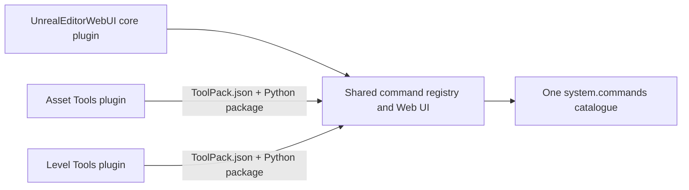

# Third-Party Tool Packs

One installed `UnrealEditorWebUI` core plugin can host commands from many independent Unreal
plugins. A **Tool Pack payload** may live in a dedicated content-only plugin or an existing
business plugin with C++ modules. In both cases the host plugin declares a dependency on the
core, ships a fixed manifest and a Python package, and imports only the stable
`unreal_editor_webui_sdk` API. Tool Pack authors do not edit or copy the core registry, bridge, or
React application.



Tool Packs are the command-extension boundary. Command metadata automatically produces the
standard forms and JSON result view. A bespoke React result renderer is still a core-frontend
change.

## Create A Pack

On Windows, scaffold a content-only plugin from the repository root:

```powershell
New-Item -ItemType Directory -Force -Path "$PWD\generated-tool-packs" | Out-Null
powershell -ExecutionPolicy Bypass -File scripts/create-tool-pack.ps1 `
  -Name StudioAssetTools `
  -Id com.studio.asset-tools `
  -CommandNamespace studio.assets `
  -OutputDirectory "$PWD\generated-tool-packs"
```

The output is a complete Unreal plugin directory. The script refuses unsafe identifiers,
path traversal, reparse-point output roots, and overwrites. A working reference is available at
[`examples/tool-packs/ExampleAssetTools`](../examples/tool-packs/ExampleAssetTools).

The required layout is:

```text
StudioAssetTools/
|-- StudioAssetTools.uplugin
`-- Content/
    |-- UnrealEditorWebUI/
    |   `-- ToolPack.json
    `-- Python/
        `-- ue_webui_toolpack_studio_asset_tools/
            |-- __init__.py
            `-- commands.py
```

`StudioAssetTools.uplugin` must be enabled, mounted, content-capable, and declare the core
dependency:

```json
{
  "FileVersion": 3,
  "Version": 1,
  "VersionName": "1.0.0",
  "CanContainContent": true,
  "NoCode": true,
  "Plugins": [
    { "Name": "UnrealEditorWebUI", "Enabled": true }
  ]
}
```

`NoCode: true` describes this standalone scaffolder output; it is not part of the runtime Tool
Pack contract.

## Add A Pack To An Existing Business Plugin

Project teams can keep their existing plugin repository and add only the Tool Pack payload. The
plugin may already contain `Modules`, content, settings, and unrelated plugin dependencies.
Run the script from this repository with its supported Node.js version available on `PATH`:

```powershell
powershell -ExecutionPolicy Bypass -File scripts/add-tool-pack.ps1 -PluginDirectory "D:\StudioPlugins\Plugins\StudioAssetTools" -Id com.studio.asset-tools -CommandNamespace studio.assets -WhatIf

powershell -ExecutionPolicy Bypass -File scripts/add-tool-pack.ps1 -PluginDirectory "D:\StudioPlugins\Plugins\StudioAssetTools" -Id com.studio.asset-tools -CommandNamespace studio.assets
```

The first command validates and previews the operation without writing. The second command:

- preserves every unrelated `.uplugin` field, existing `Modules`, and existing dependencies;
- sets `CanContainContent` to `true`;
- adds or normalizes one enabled `UnrealEditorWebUI` dependency;
- creates the fixed manifest plus a unique
  `ue_webui_toolpack_<plugin_name>` Python package and a smoke command.

The script requires exactly one regular root `.uplugin`, parses it as strict UTF-8 JSON, rejects
duplicate decoded JSON keys and ambiguous field casing, and refuses plugin directories or output
paths that are reparse points. It never overwrites an existing `ToolPack.json` or generated Python
package. Running it again reports a conflict and leaves the plugin unchanged.

An existing code-plugin descriptor remains a code plugin:

```json
{
  "FileVersion": 3,
  "Version": 17,
  "VersionName": "2.4.1",
  "CanContainContent": true,
  "Modules": [
    {
      "Name": "StudioAssetTools",
      "Type": "Editor",
      "LoadingPhase": "Default"
    }
  ],
  "Plugins": [
    { "Name": "UnrealEditorWebUI", "Enabled": true }
  ]
}
```

The runtime boundary is the manifest and Python package inside an enabled, mounted,
content-capable plugin. It does not require `NoCode`, remove C++ modules, or copy the shared core
into the business plugin.

## Manifest Contract

The manifest location is fixed:

```text
<ToolPack>/Content/UnrealEditorWebUI/ToolPack.json
```

Schema v1 is a closed object with exactly these fields:

```json
{
  "schemaVersion": 1,
  "id": "com.studio.asset-tools",
  "requiredCoreApi": 1,
  "pythonPackage": "ue_webui_toolpack_studio_asset_tools",
  "commandNamespace": "studio.assets"
}
```

- `id` is the stable lowercase pack identity. Use a reverse-DNS value.
- `requiredCoreApi` must equal `unreal_editor_webui_sdk.SDK_API_VERSION`. Version 1 intentionally
  uses exact integer matching.
- `pythonPackage` is a dotted import name rooted under the same plugin's `Content/Python`. It must
  resolve to a real package, with every dotted package segment containing `__init__.py`; it is not
  a file path or namespace package. Its top-level segment must be globally unique across all Tool
  Packs and must not collide with an already importable or Python standard-library package. The
  scaffolder adds a `ue_webui_toolpack_` prefix for this reason.
- `commandNamespace` owns that dotted command prefix. Every command registered by the pack must
  start with `<commandNamespace>.`. It must not equal, contain, or be contained by another Tool
  Pack namespace on a dot boundary. For example, `studio.assets` conflicts with
  `studio.assets.validate`, while `studio.assets2` is independent.

Unknown keys, duplicate JSON keys, unsupported versions, malformed identifiers, oversized or
deep manifests, escaped paths, and missing packages reject that pack. The manifest cannot add a
Python search path or name an arbitrary file.

## Register Commands Through The SDK

Third-party code imports the public SDK, never `unreal_editor_webui_registry`:

```python
from typing import Any

from unreal_editor_webui_sdk import CommandExecutionError, command


@command(
    "studio.assets.validate",
    description="Validate selected assets.",
    permission="read",
    schema={
        "type": "object",
        "properties": {
            "strict": {"type": "boolean", "default": False},
        },
        "additionalProperties": False,
    },
    category="Studio Asset Tools",
    tags=["assets", "validation"],
)
def validate(payload: dict[str, Any]) -> dict[str, Any]:
    if payload["strict"] and not can_run_strict_validation():
        raise CommandExecutionError(
            "strict_validation_unavailable",
            "Strict validation is unavailable in this project.",
        )
    return {"valid": True}
```

Place `.py` modules or packages containing `__init__.py` below the declared package. The core
builds an exact canonical-file allowlist, imports the package, and walks those submodules in
deterministic order. Keep module top levels limited to imports and command registration; perform
editor or filesystem work inside handlers.

Do not import the package from `init_unreal.py` or another startup hook. SDK registration is open
only while the core is explicitly loading built-ins or that Tool Pack; registration outside that
context is rejected so namespace ownership and whole-pack rollback cannot be bypassed.

Every command name must be a dotted ASCII identifier with at least two segments and at most 256
characters. Each segment starts with a lowercase letter; remaining characters may be ASCII
letters, digits, or underscores, so lower-camel names such as `studio.assets.validateNaming` are
valid. Whitespace, hyphens, empty segments, uppercase segment starts, and oversized names reject
the complete pack atomically.

The command schema, permissions, task execution metadata, and response envelopes are the same as
built-in commands. See [the integration guide](integration-guide.md#discover-commands)
for the schema-v1 contract.

## Install And Verify Multiple Packs

Install the core once, then copy any number of Tool Pack directories alongside it:

```text
<Project>/Plugins/
|-- UnrealEditorWebUI/
|-- StudioAssetTools/
`-- StudioLevelTools/
```

`StudioAssetTools` may be a dedicated Tool Pack or the team's existing business plugin. Other
plugins can declare `UnrealEditorWebUI` as their shared dependency in exactly the same way; do not
place a private copy of the core inside each business plugin.

Enable all three plugins and restart Unreal Editor. Tool Pack discovery occurs once during core
registry initialization; v1 does not hot-load, hot-unload, or reload packs.

Open `Window > Unreal Editor WebUI` and search for the new commands. For a direct smoke test, run
`system.commands` and confirm that:

- commands from every installed pack are present;
- `loadErrors` is empty;
- each pack's generated `<namespace>.ping` command executes successfully.

Then run `system.toolPacks`. Its `statusVersion: 1` response should contain one `loaded` entry per
pack, the expected `.uplugin` `pluginVersion` and `requiredCoreApi`, and the number of commands
owned by that pack. Its sorted `commands` list maps the already-public `system.commands` names to
their provider. Rejected descriptors and manifest-discovery failures are also listed with
`state: "rejected"` and an empty `commands` list; a manifest rejected before its descriptor is
trusted exposes only a sanitized `pluginName`, with `provider`, `packId`, `pluginVersion`, and
`requiredCoreApi` set to `null`. Safe reasons remain in `system.commands.loadErrors`.
`truncatedCount` is a saturating cumulative count of status observations omitted across
publications by the fixed processing and output bounds. Re-observing an omitted status increments
the count again; the core does not retain an unbounded hidden-provider history.

Each Tool Pack can be versioned and distributed as its own Unreal plugin archive. Because its
manifest and Python sources live under `Content/`, Unreal `BuildPlugin` includes them without a
custom root-file filter. Recipients still need one compatible `UnrealEditorWebUI` core plugin;
the `.uplugin` dependency expresses the requirement but does not download it.
If the host business plugin contains C++ modules, build and distribute a separate plugin package
for every supported Unreal Engine minor version; do not reuse its native binaries across UE
versions.

## Isolation And Conflict Rules

- Packs are loaded in a stable order independent of Unreal's plugin enumeration order.
- Duplicate pack IDs or Python packages reject every member of the conflicting group before
  import. Equal or dot-boundary ancestor/descendant command namespaces are also rejected on both
  sides. Python-package conflicts are evaluated by case-insensitive top-level package segment, so
  dotted packages such as `vendor.alpha` and `vendor.beta` must not be split across independent
  packs.
- If a pack fails halfway through import, all commands it registered are removed. Healthy packs
  and core commands remain available.
- A command outside the declared namespace or a command collision rejects the entire offending
  pack.
- Bounded diagnostics appear in `system.commands.loadErrors`; full tracebacks go only to the
  Unreal log and do not expose absolute paths to the Web UI.
- `system.toolPacks` exposes sanitized provider/version/API/state fields plus bounded command
  counts and sorted owned command names already present in `system.commands`. It does not return
  paths, Python package names, the manifest namespace as a separate field, errors, or tracebacks.
- Core bootstrap commands such as `system.ping`, `system.commands`, and `system.toolPacks` remain
  available even when a third-party pack fails.
- V1 limits the shared registry to 256 commands, each command's metadata to 256 KiB, the metadata
  catalogue to 3 MiB, each Tool Pack to 256 discovered submodules, and surfaced load diagnostics
  to 128 entries. Command names are capped at 256 characters. Tool Pack status is capped at 384
  entries and reports a saturating cumulative count of omitted status observations. Exceeding a
  registration limit rejects the offending pack atomically.

This is registration isolation, not a security sandbox. Tool Pack Python is trusted editor code
and can call Unreal, Python, OS, network, and filesystem APIs. Registry and module-cache rollback
cannot undo side effects already performed during import. Review a pack before enabling it, and
do not put work with side effects at module top level.

## Compatibility

The maintained Tool Pack discovery path is available in the current post-v0.2.0 source, targets
UE 5.8, and uses SDK API 1. The first prebuilt release expected to include it is v0.3.0. It uses
Unreal's enabled/mounted plugin API and the standard `<Plugin>/Content/Python` module path.
`requiredCoreApi` protects the Python extension contract; the Tool Pack plugin's `VersionName`
remains the pack's independently managed release version.
